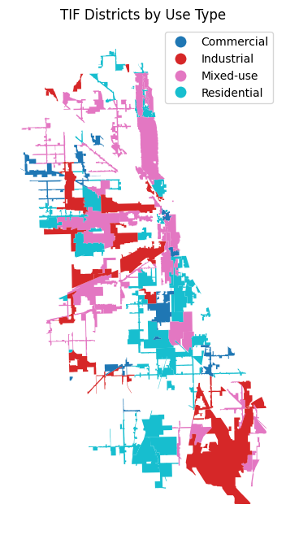

### Aisaiah Pellecer
### Professor Uhe
### IS445 Data Visualization
### Final Project 
***

#### Biggest Takeaway

Over the course of my time at the University of Illinois Urbana-Champaign, I have engaged in a multitude of data visualization projects and have applied my knowledge to external projects as well.

What I appreciated about this course is the exposure to a variety of different data visualization tools and the expansion of my skillset. Surely, most data scientists or budding professionals in the 'data' field are aware of libraries like Matplotlib and Seaborn, but they can often be limited by industry standards. Additionally, what I appreciated about this course is its focus on assessing the composition of a data visualization and understanding the ways in which it communicates and satisfies its audience's needs.

Personally, I am happy to have learned to create interactive data visualizations—especially GIS visualizations—and the time I took to criticize visualizations. This class has allowed me to learn about the critical components that researchers and professionals in my field focus on when creating visualizations.

#### Course Improvements

Similar to my other course, IS497 Data Administration and Scaling, I appreciated the focus on exposure and learning how to use different tools/libraries. However, I think that taking the time to learn how to create and host interactive data visualization applications would have been nice!

There are a lot of nice libraries like Dash, Plotly, and Streamlit that enable individuals to create data visualizations that can be embedded within applications/websites. Learning something like this would be nice, and I hope that future iterations of this class may take one of these libraries/frameworks into consideration. Overall, I am satisfied with this class! I appreciate the professor's flexibility, the breadth of his presentations, and the freedom to experiment/learn (as this final project showcases). Thank you!

***

Here is a sample visualization I made of the TIF Districts, categorized by use type:

